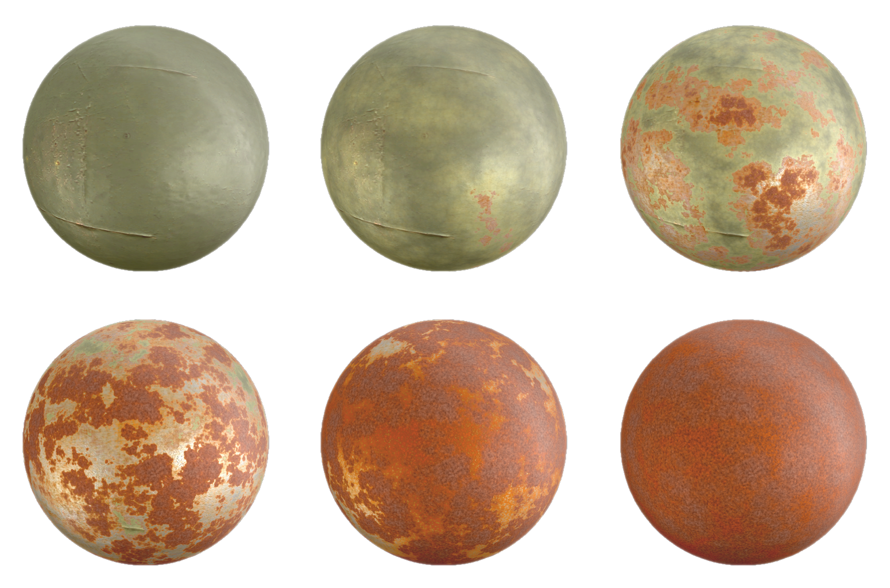
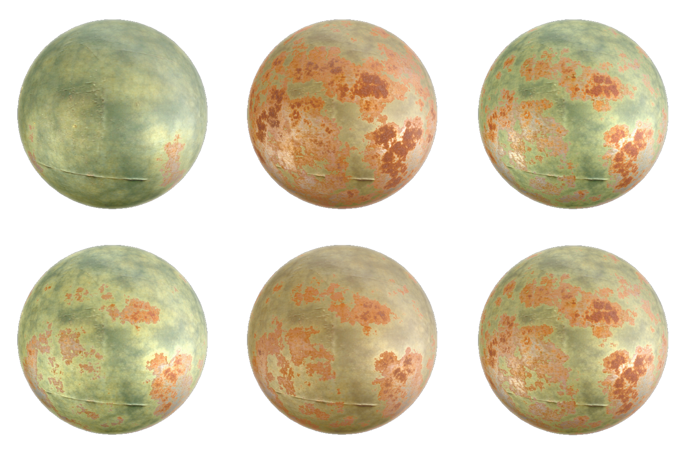
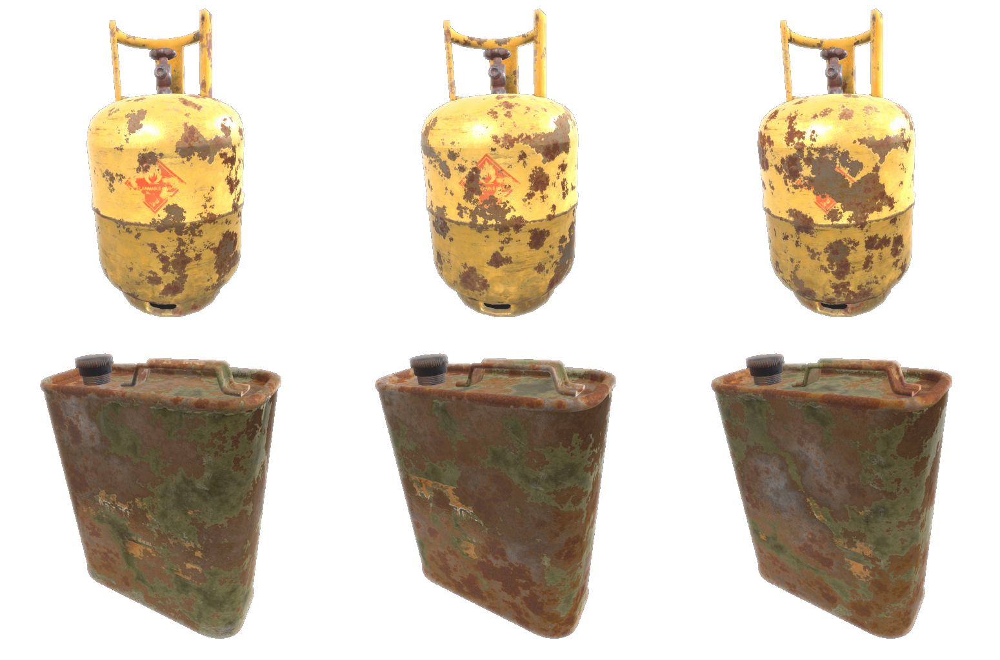
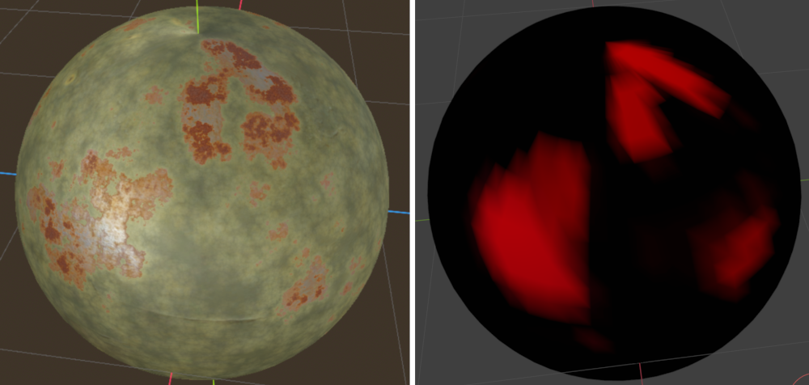
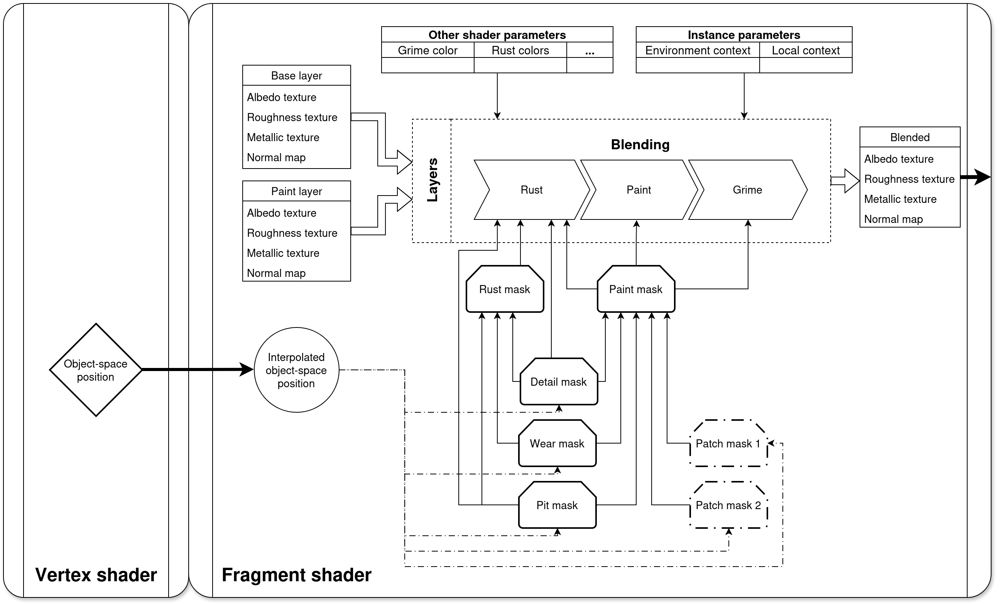

# Procedural-Aging
This project introduces a context-based system for the procedural aging/weathering of shader-based materials in Godot.
It aims to achieve real-time weathering with interactive control and minimal memory requirements.
For context-based shading, it makes use of various environment and local context parameters, configurable with the help of a provided Godot [addon](#context-probe-addon). 

While this system is material-independent, its usefulness is illustrated with a shader that weathers painted metals (Painted Metal Aging Shader (PMA-S)). The shader takes surface property textures for a substrate and a coating, then dynamically blends between them (real-time and completely stateless) while maintaining spatial and temporal consistency.

<div align="center"></div>

Context-based parameter changes can impact the appearance of object instances even if object age and all non-instance material parameters are the same.

<div align="center"></div>

And RNG can also differentiate objects that otherwise share the exact same parameters.

<div align="center"></div>


Beyond the parameters that can be edited in the Godot material view, PMA-S also allows using vertex colors to control the degree of weathering across a mesh surface. When the use of vertex weights is activated, a vertex color channel can be chosen to reflect weathering intensity.

<div align="center"></div>

#### Figure license
- The spheres in these figures use the following basis textures for blending: https://polyhaven.com/a/green_metal_rust (Rob Tuytel) and https://polyhaven.com/a/rusty_metal_sheet (Amal Kumar)
    (Both under https://creativecommons.org/publicdomain/zero/1.0/)
- The canister figure uses models from https://skfb.ly/oFV7p (vmatthew) under https://creativecommons.org/licenses/by/4.0/

## Scenes and scripts
A variety of scenes are provided alongside the prototype code.

- **demos**: Scenes that demonstrate [specific features](#demos).
- **profiling**: Scenes that can be used to [profile](#profiling) the performance of the prototype.
- **testing**: Scenes that were used in testing and development and may still be useful for understanding the interface.
- **visualizations**: Scenes that can be used for visualizing output and computation components of the shader, such as specific noise functions.

The script directories that correspond to these scenes contain utility code that may also be useful for understanding how the prototype interfaces with Godot.
In particular, *aging_object.gd* is a good example.

Beyond scene-specific scripts, there is also code related to **baking**, which is explained in its [own section](#baking).

## Assets
While the actual prototype code provided with this repository is complete, the demo, profiling, and testing scenes all depend on CC licensed assets.
In the **releases** tab, the **Assets-1.0** release contains the asset directory, split into three *.tar* files.

After downloading these files into the root of the *procedural_aging* directory, run
```
cat assets.tar.* | tar -xf -
```
to unpack the asset directory with the correct path structure.
Once that is done, Godot should recognize and import all assets correctly.

The **CREDITS.md** file provides author and licensing information for all assets that were not made by me.
My own assets use the same license as this repository.

## Context Parameters
Beyond shader- and material-specific parameters, there are properties of object instances and their environments that also affect weathering.
Here, these are separated into:
- **local context**: Properties of an object instance (*age* and *paint stability* in the case of PMA-S). These are stored in object scripts.
- **environment context**: Properties of the environment in which an object exists. These are stored using the **Context Probe** addon.

#### Context Probe Addon
This addon introduces three node classes:
1. **ContextParams**: A resource class that stores a set of environment context parameters and emits a "changed" signal whenever they are modified so that **ContextSampler** nodes can listen for it. For this prototype, only three parameters exist, but the class can easily be extended:
    - *uv_and_heat*: Combines both the UV intensity and heat intensity of the environment. Influences effects such as paint yellowing.
    - *pollution*: Dirt, toxicity, pathogens and other waste products in the environment. Influences grime deposition and surface discoloration.
    - *moisture*: Combines both air humidity and the frequency of exposure to water. Speeds up degradation and corrosion significantly.

    Besides their individual effects, they also all influence the general weathering intensity.
2. **ContextSampler**: A monitoring node that samples **ContextParams** from **ContextProbe**s that it intersects and emits signals whenever the sampled parameters change. Intended to be a child of a node that uses context-based shading. For multiple probes it averages their values, and for no probes it returns default **ContextParams**.
3. **ContextProbe**: An **Area3D** that stores **ContextParams**. 

A demo for the context probe system is provided. More information is in the [demo section](#demos).

## Shaders
The *shaders* directory is divided into the following structure:
- Shader-ready configurations of PMA-S at the root
- *pma_include*: Actual implementation code of PMA-S
- *debug*: Shaders used for profiling and visualization
- *baking*: Non-PMA shader code that is used to display baked textures.

#### Shader configurations
By choosing to use ```#define BAKE_MODE``` and ```#define INSTANCE_UNIFORMS```, different configurations of PMA-S can be compiled. By default, the following are provided:
- *baked_pma*: PMA-S configured to be used in baking. Includes UV-reprojection for texture rendering, making it unusable for normal spatial shading. Does not use any instance uniforms.
- *instanced_pma*: PMA-S configured to be used in real-time spatial rendering with instance uniforms for context parameters and the RNG seed.
- *non_instanced_pma*: PMA-S configured to be used in real-time spatial rendering without any instance uniforms. All shader parameters are per-material, not per-instance. This is useful for testing parameters that would otherwise be instance uniforms in the material editor.

#### pma_include
The implementation code for PMA-S includes the following files:
- *masks.gdshaderinc*: Samples and composites 3D noise masks that are used for blending between substrate and coating.
- *pma.gdshaderinc*: Core implementation, performs the actual blending of surface properties.
- *pma_header.gdshaderinc*: Contains all PMA-S uniforms. Separated so that debug shaders can easily use the same uniforms.
- *snoise3d.gdshaderinc*: 3D simplex noise implementation. Licensing and credits are within the file and in [LICENSE](LICENSE)
- *voronoi_fbm.gdshadering*: Implementations of various voronoi noise and FBM functions.

Almost all computation is done in the fragment shader, which is how memory requirements are kept minimal. Here, the various 3D masks are sampled based on the object-space position of the fragment to keep spatial consistency and then used to blend between the input textures.
<div align="center"></div>

## Baking
While the focus of PMA-S is on running in real-time, some code is also provided to allow saving the results to static textures.

The [AgeBaker](scripts/baking/age_baker.gd) allows registering geometry instances along with the material that should be baked. Once bake() is called, all registered instances are baked at the same time and their materials are overwritten with shaders that display the baked textures.

Note that the given material needs to be in ```BAKE_MODE``` for this to work.

The [baked_aged_object](scripts/baking/baked_aged_object.gd) script also allows exporting the textures to permanent storage.

## Demos
This project provides a few demo scenes for the appearance and infrastructure of PMA-S and the context-based shading system.
Some can be accessed through the main scene menu:
- **Shipyard**: An old shipyard. The user can walk through the scene and approach podiums with red buttons. If pressed with the mouse (after pressing *TAB* to activate the UI and mouse control), a menu opens up that allows dynamic modification of the weathered appearance of the object that the podium corresponds to. The intent of this demo is to show how the shader can integrate with "complex" scenes in real-time. Movement is controlled with *WASD* and *Shift* for faster walking. 
- **Single objects**: This demo allows modifying the weathered appearance of various objects. It is controlled entirely with the UI that is toggled with *TAB*. The parameters that can be edited here represent just a small selection. The Godot editor should be used to modify other parameters of the shader.
- **Context**: This demo showcases the **ContextProbe** system. With the use of *WASD*, *Shift*, *Space*, and the *Arrow keys* for movement, as well as the UI toggled with *TAB*, the user can see the effect of probes on varying amounts of object instances. To modify the probes themselves (both their parameters and their shapes/transforms), the scene needs to be run within the Godot editor. A system for visualizing probe areas in the run-time view is provided so that they can be matched up to what is being edited in the scene view, but it only supports spheres, cylinders and boxes. Other shapes can be used but do not have a run-time visualization.

The last demo can only be accessed within the Godot editor:
- **Vertex painting**: A sphere that uses vertex colors as weathering weights. Using the shader parameter editor, the effect of various vertex weight configurations can be seen. Modifying the vertex colors in the corresponding *assets/vert_color_test.blend* file allows live changes to the vertex weight distribution.

## Profiling
The main menu has a button for **profiling**. From the main profiling scene, various subscenes can be opened and
modified to profile the performance of PMA-S (as well as the baked equivalent) under specific conditions.

The UI in the top left has input options that stay the same for all profiling scenes, such the scene picker itself, the shader picker, bake resolution, and more. It also contains a "Run suite" button. This disables vsync and the UI to run all profiling scenes in various configurations. The results are written to the default Godot user directory. This suite is only run for the selected shader (and, if baked, the selected resolution). To test different shaders and resolutions, the old results need to be saved and the suite re-run.

**NOTE**: The vsync button and the automatic vsync disabling of the profiling suite may not work depending on operating system restrictions. The user may have to take additional steps to allow running with an un-capped framerate.

The bottom left UI has options that are specific to the current scene:
- **rotating_object**: This scene weathers a rotating object (sphere or quad) over time. The menu allows adjusting the mesh and its triangle complexity.
- **multiple_objects**: This scene weathers multiple objects. The menu allows adjusting the layout and amount of objects. It also allows changing between **instanced** (uses MultiMeshInstance3D -> all instances share the same appearance) and **non-instanced** (all objects have a unique appearance).
- **pixel_count**: This scene weathers a dynamically sized quad to profile performance with respect to pixel count.
- **lights**: This scene allows profiling the shader with varying amounts of light sources.
- **parameters**: This scene is used by the automatic profiling suite only. It tests a quad at various shader parameter configurations but has no GUI of its own.